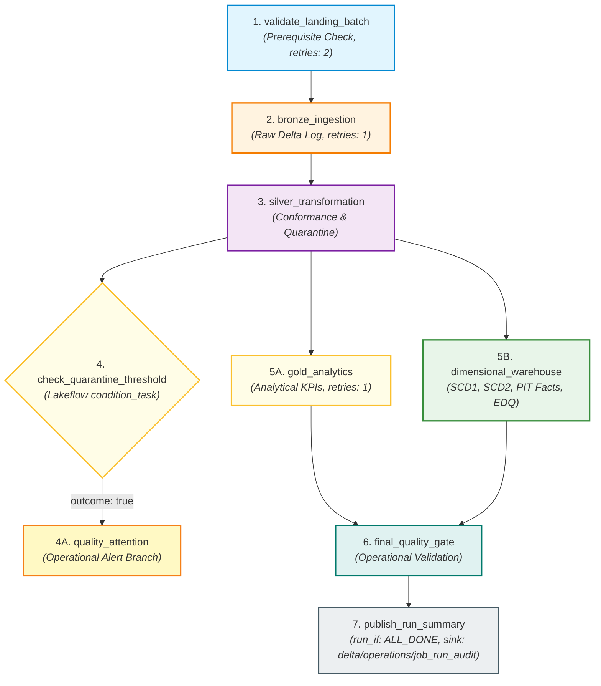
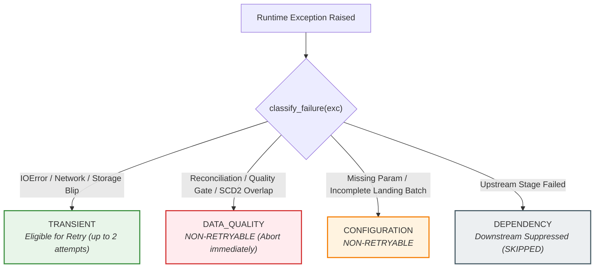

# Module 5: Lakeflow Jobs Orchestration, Reliability & Operational Monitoring

## 1. Executive Summary & Terminology

### Modern Databricks Terminology: Lakeflow Jobs
In modern Azure Databricks architecture, multi-task orchestration workflows are officially called **Lakeflow Jobs** (historically known as *Databricks Workflows* or *Databricks Jobs*).

```
┌────────────────────────────────────────────────────────────────────────┐
│                          LAKEFLOW JOBS                                 │
│  The unified orchestration control plane in Databricks for scheduling, │
│  monitoring, and running multi-task data & AI pipelines with           │
│  built-in reliability, Serverless compute, and repair capabilities.    │
└────────────────────────────────────────────────────────────────────────┘
```

### Orchestration vs. Transformation
- **Transformation (Modules 1–4):** The *computation* applied to data (e.g., PySpark cleansing, window deduplication, Delta MERGE, SCD Type 1 / Type 2, point-in-time surrogate key lookups).
- **Orchestration (Module 5):** The *operational management* of transformations—controlling execution order (DAG), passing run-time parameters, evaluating task health, managing retries, branching on conditions, and recording durable run audits.

---

## 2. Multi-Task DAG Architecture

Module 5 defines a production-grade multi-task Directed Acyclic Graph (DAG) with condition branching in [`databricks/jobs/retail_lakehouse_job.yml`](file:///Users/vijjureddy/Job%20Switch%20Projects/azure-lakehouse-data-platform/databricks/jobs/retail_lakehouse_job.yml):



### Task Responsibilities & Contracts

| Task Key | Type | Depends On | `run_if` | Retries | Timeout | Task Values Published |
| :--- | :--- | :--- | :--- | :--- | :--- | :--- |
| `validate_landing_batch` | `notebook_task` | None | `ALL_SUCCESS` | 2 | 600s | `landing_ready`, `discovered_dataset_count`, `missing_dataset_count`, `ingestion_date`, `adf_run_id`, `landing_root` |
| `bronze_ingestion` | `notebook_task` | `validate_landing_batch` | `ALL_SUCCESS` | 1 | 1200s | `bronze_rows_ingested`, `datasets_processed` |
| `silver_transformation` | `notebook_task` | `bronze_ingestion` | `ALL_SUCCESS` | 1 (Transient only) | 1800s | `silver_valid_rows`, `silver_quarantine_rows`, `reconciliation_passed`, `quarantine_rate`, `quarantine_alert_triggered` |
| `check_quarantine_threshold` | `condition_task` | `silver_transformation` | `ALL_SUCCESS` | 0 | - | Evaluates: `quarantine_alert_triggered == true` |
| `quality_attention` | `notebook_task` | `check_quarantine_threshold` (`outcome: true`) | `ALL_SUCCESS` | 0 | 300s | `quality_attention_required`, `quarantine_alert_logged` |
| `gold_analytics` | `notebook_task` | `silver_transformation` | `ALL_SUCCESS` | 1 | 1200s | `gold_tables_generated` |
| `dimensional_warehouse` | `notebook_task` | `silver_transformation` | `ALL_SUCCESS` | 1 (Transient only) | 2400s | `fact_sales_rows`, `fact_returns_rows`, `warehouse_quality_passed` |
| `final_quality_gate` | `notebook_task` | `gold_analytics`, `dimensional_warehouse` | `ALL_SUCCESS` | 0 | 600s | `final_quality_gate_passed`, `overall_quality_status` |
| `publish_run_summary` | `notebook_task` | `final_quality_gate` | `ALL_DONE` | 1 | 300s | None (Persists `JobRunAudit` to Delta) |

---

## 3. Real Lakeflow Execution Contracts & Task Wrapper Notebooks

To maintain a clean boundary between **Orchestration Behavior (Module 5)** and **Packaging/Build/CI/CD (Module 6)**, Lakeflow tasks are executed via thin Databricks task wrapper notebooks located in [`databricks/tasks/`](file:///Users/vijjureddy/Job%20Switch%20Projects/azure-lakehouse-data-platform/databricks/tasks/):

- `validate_landing.py`
- `run_bronze.py`
- `run_silver.py`
- `quality_attention.py`
- `run_gold.py`
- `run_warehouse.py`
- `final_quality_gate.py`
- `publish_run_summary.py`

Each task wrapper notebook:
1. Retrieves task parameters from `dbutils.widgets`.
2. Constructs a strongly-typed `RunContext`.
3. Calls the reusable Python implementation from `src/orchestration/tasks/*`.
4. Publishes runtime telemetry to Lakeflow Jobs via `dbutils.jobs.taskValues.set()`.

---

## 4. Landing Batch Completeness & Exact Batch Isolation

### 8-Dataset Completeness Requirement
In production batch orchestration, `validate_landing_batch` verifies that all 8 required datasets exist matching both `ingestion_date` and `adf_run_id`:
- `customers`, `products`, `stores`, `employees`, `orders`, `order_items`, `payments`, `returns`.
- If any required dataset is missing, it raises `LandingBatchIncompleteError` and aborts early before compute is consumed on Bronze ingestion.

### String-Safe Cloud URI Composition (`join_storage_uri`)
Cloud URIs (`abfss://<container>@<account>.dfs.core.windows.net/...`) are never wrapped in `pathlib.Path` (which would mutilate `abfss://` into `abfss:/`). The `join_storage_uri` utility ensures safe path composition across both local filesystem and cloud object stores.

### Batch-Isolated Bronze Ingestion
Bronze ingestion accepts optional `ingestion_date` and `adf_run_id` filters. When supplied by the orchestrator, Bronze ingests only files belonging to that specific ADF pipeline run, ensuring strict batch isolation and rerun idempotency.

---

## 5. Conditional Branching: Quarantine Warning vs. Critical Quality Failure

```
┌────────────────────────────────────────────────────────────────────────┐
│                        ARCHITECTURAL DISTINCTION                       │
│                                                                        │
│  QUARANTINE WARNING:                                                   │
│  - Quarantine rate exceeds threshold (e.g. > 20%).                     │
│  - Isolated bad records routed to quarantine. Conformed valid records  │
│    remain mathematically reconciled (Bronze = Valid + Quarantine).     │
│  - Triggers 'quality_attention' branch for operator notification.      │
│  - Downstream Gold & Warehouse processing CONTINUES.                   │
│                                                                        │
│  CRITICAL DATA QUALITY FAILURE:                                        │
│  - Broken mathematical reconciliation (ReconciliationError).           │
│  - Broken surrogate key invariants (WarehouseQualityGateError).        │
│  - Hard-fails the task immediately and aborts downstream execution.    │
└────────────────────────────────────────────────────────────────────────┘
```

---

## 6. Failure Taxonomy & Intelligent Retry Policies



### Lakeflow Task Retries vs. Local Classification
- **Databricks Lakeflow YAML:** Configured conservatively with 1–2 retries for transient infrastructure resilience.
- **Python Task Layer:** Deterministic data quality errors (`ReconciliationError`, `WarehouseQualityGateError`, `LandingBatchIncompleteError`) fail fast without wasting retries.

---

## 7. Zero Legacy DBFS Mount Paths & Operations Catalog Registration

### No Legacy `/mnt/` Dependencies
Module 5 completely eliminates legacy `/mnt/` DBFS mount paths. All Delta tables use governed ABFSS URIs or Unity Catalog 3-level namespace identifiers.

### Operations Unity Catalog Schema
Operational run audits are registered under Unity Catalog:
```sql
CREATE CATALOG IF NOT EXISTS retail_lakehouse;
CREATE SCHEMA IF NOT EXISTS retail_lakehouse.operations;
CREATE TABLE IF NOT EXISTS retail_lakehouse.operations.job_run_audit
USING DELTA
LOCATION 'abfss://lakehouse@stlakehousedev.dfs.core.windows.net/delta/operations/job_run_audit';
```

---

## 8. Durable Operational Run Audit Model

Persists exactly one row per Lakeflow Job execution to `delta/operations/job_run_audit` under `run_if: ALL_DONE` semantics:
- Guaranteed to record on both successful runs and early aborts.
- Early aborts record `failure_task`, `failure_classification`, and `error_message` while leaving un-executed downstream metrics nullable.

---

## 9. Repair-Run Workflow Demonstration

In Databricks Lakeflow Jobs, when a pipeline fails at a downstream task (e.g. `dimensional_warehouse`), operators can trigger a **Repair Run**:
1. Completed upstream tasks (`validate_landing_batch`, `bronze_ingestion`, `silver_transformation`) are **skipped** without re-executing.
2. The repaired task re-runs.
3. Due to Module 3 and Module 4 deterministic surrogate key generation and Delta MERGE idempotency, repair runs will never corrupt state or produce duplicate records.

---

## 10. Verification & Cloud Status

- **Automated Test Suite:** **83 / 83 PASSED (100%)**
  - Module 1 (PySpark Data Engineering): 15 Tests
  - Module 2 (ADF & ADLS Gen2 Cloud Ingestion): 14 Tests
  - Module 3 (Databricks + Delta Lake Medallion): 18 Tests
  - Module 4 (Dimensional Warehouse + SCD + EDQ): 19 Tests
  - Module 5 (Lakeflow Jobs Orchestration & Audit): 17 Tests (15 unit + 2 integration)
- **Ruff Static Analysis:** 0 errors (`All checks passed!`)
- **Cloud Verification Status:** `LAKEFLOW JOB DEFINITION: DEPLOYMENT-READY`, `CLOUD EXECUTION: PENDING`
- **Learning Status:** `NOT STUDIED / PENDING`
