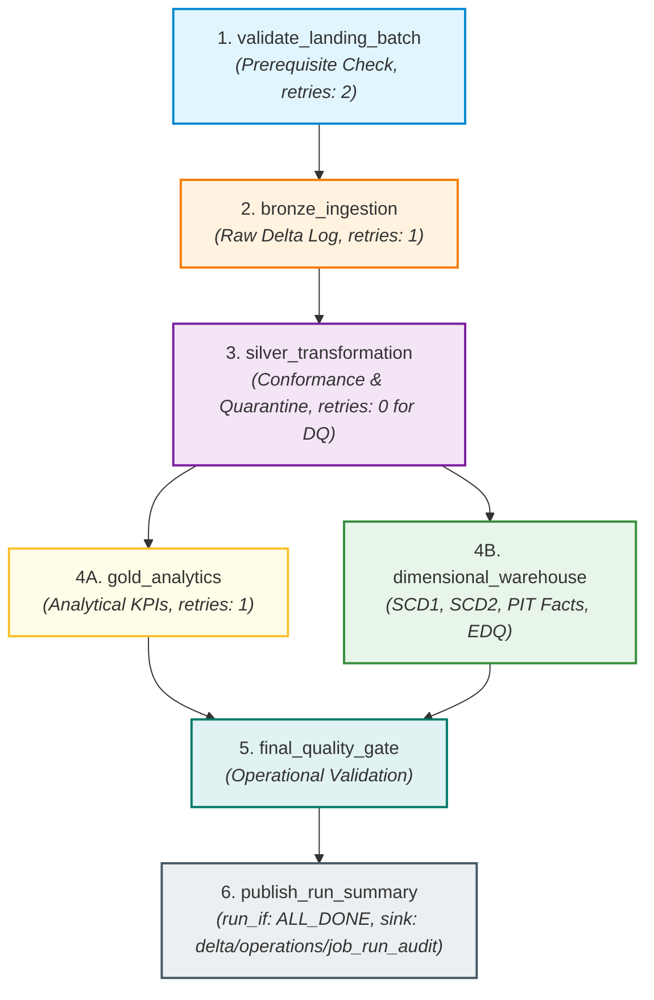
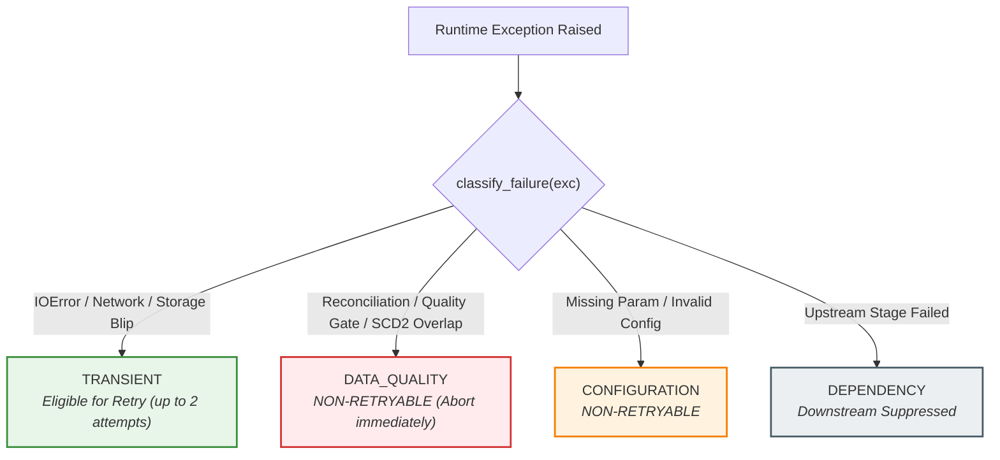
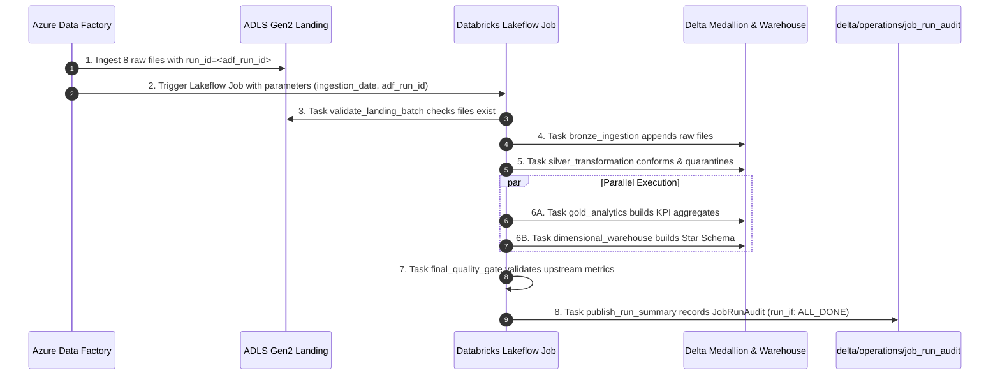

# Module 5: Lakeflow Jobs Orchestration, Reliability & Operational Monitoring

## 1. Executive Summary & Terminology

### Modern Databricks Terminology: Lakeflow Jobs
In modern Azure Databricks architecture, multi-task orchestration workflows are officially called **Lakeflow Jobs** (historically known as *Databricks Workflows* or *Databricks Jobs*).

```
┌────────────────────────────────────────────────────────────────────────┐
│                          LAKEFLOW JOBS                                 │
│  The unified orchestration control plane in Databricks for scheduling, │
│  monitoring, and running multi-task data & AI pipelines with           │
│  built-in reliability, Serverless compute, and repair capabilities.    │
└────────────────────────────────────────────────────────────────────────┘
```

### Orchestration vs. Transformation
- **Transformation (Modules 1–4):** The *computation* applied to data (e.g., PySpark cleansing, window deduplication, Delta MERGE, SCD Type 1 / Type 2, point-in-time surrogate key lookups).
- **Orchestration (Module 5):** The *operational management* of transformations—controlling execution order (DAG), passing run-time parameters, evaluating task health, managing retries, branching on conditions, and recording durable run audits.

---

## 2. Multi-Task DAG Architecture

Module 5 defines a production-grade multi-task Directed Acyclic Graph (DAG) in [`databricks/jobs/retail_lakehouse_job.yml`](file:///Users/vijjureddy/Job%20Switch%20Projects/azure-lakehouse-data-platform/databricks/jobs/retail_lakehouse_job.yml):



### Task Responsibilities & Contracts

| Task Key | Depends On | `run_if` | Retries | Timeout | Task Values Published |
| :--- | :--- | :--- | :--- | :--- | :--- |
| `validate_landing_batch` | None | `ALL_SUCCESS` | 2 | 600s | `landing_ready`, `discovered_dataset_count`, `batch_path` |
| `bronze_ingestion` | `validate_landing_batch` | `ALL_SUCCESS` | 1 | 1200s | `bronze_rows_ingested`, `datasets_processed` |
| `silver_transformation` | `bronze_ingestion` | `ALL_SUCCESS` | 1 (Transient only) | 1800s | `silver_valid_rows`, `silver_quarantine_rows`, `reconciliation_passed`, `quarantine_rate`, `quarantine_alert_triggered` |
| `gold_analytics` | `silver_transformation` | `ALL_SUCCESS` | 1 | 1200s | `gold_tables_generated` |
| `dimensional_warehouse` | `silver_transformation` | `ALL_SUCCESS` | 1 (Transient only) | 2400s | `fact_sales_rows`, `fact_returns_rows`, `warehouse_quality_passed` |
| `final_quality_gate` | `gold_analytics`, `dimensional_warehouse` | `ALL_SUCCESS` | 0 | 600s | `final_quality_gate_passed`, `overall_quality_status` |
| `publish_run_summary` | `final_quality_gate` | `ALL_DONE` | 1 | 300s | None (Persists `JobRunAudit` to Delta) |

---

## 3. Cross-Task Communication (Task Values)

In Lakeflow Jobs, tasks pass small operational metadata to downstream tasks using **Task Values**:
- In Python / Databricks notebooks: `dbutils.jobs.taskValues.set(key="discovered_count", value=8)` and `dbutils.jobs.taskValues.get(taskKey="validate_landing_batch", key="discovered_count")`.
- In Lakeflow Jobs YAML configuration: `{{tasks.<task_name>.values.<value_name>}}`.

> [!IMPORTANT]
> **Data Size Constraint:** Task values are strictly designed for small metadata primitives (strings, numbers, booleans, small JSON dicts). They must NEVER be used to pass tabular datasets. Large data assets remain persisted in ADLS Gen2 / Delta Lake and are referenced via paths or catalog table identifiers.

---

## 4. Job Parameters & Dynamic Value References

Lakeflow Jobs parameters configure execution behavior without hardcoding run identifiers:

```yaml
parameters:
  - name: environment
    default: "dev"
  - name: ingestion_date
    default: "{{job.start_time.iso_date}}"
  - name: adf_run_id
    default: "manual_orchestration_run"
  - name: storage_account_name
    default: "stlakehousedev"
  - name: container_name
    default: "lakehouse"
  - name: catalog_name
    default: "retail_lakehouse"
  - name: quarantine_threshold_rate
    default: "0.20"
```

### Modern vs. Deprecated Dynamic Variable Syntax

| Modern Syntax (Required) | Deprecated Syntax (Forbidden) | Description |
| :--- | :--- | :--- |
| `{{job.id}}` | `{{job_id}}` | Unique numeric/string identifier of the Job |
| `{{job.run_id}}` | `{{run_id}}` | Unique run identifier of the current execution |
| `{{job.start_time.iso_date}}` | `{{start_date}}` | Start date in ISO `YYYY-MM-DD` format |
| `{{job.parameters.<param>}}` | `` | Reference to job-level parameter |
| `{{tasks.<task>.values.<val>}}` | N/A | Reference to upstream task-value output |

---

## 5. Reliability, Intelligent Retries & Failure Classification

Not all pipeline failures should be treated equally:



### The Architectural Rule: Transient vs. Deterministic
1. **TRANSIENT Failures:** A transient storage timeout or file lock may resolve after a brief backoff period. Lakeflow Jobs retries these tasks up to configured `max_retries`.
2. **DETERMINISTIC Failures (Data Quality):** If Silver mathematical reconciliation fails (`bronze != valid + quarantine`) or a fact table violates warehouse quality gates, **retrying with unchanged input data will produce the exact same failure**. Retrying wastes cloud compute and delays alerting. The task aborts immediately with `DATA_QUALITY` classification.

---

## 6. Databricks Repair-Run Mechanics & Idempotency

### What is a Repair Run?
When a multi-task Lakeflow Job fails midway (e.g. at `dimensional_warehouse`), Databricks allows engineers to trigger a **Repair Run** rather than rerunning the entire pipeline from scratch.

- Databricks re-executes **ONLY the failed task(s)** and any downstream dependent tasks.
- Successfully completed upstream tasks (e.g. `validate_landing_batch`, `bronze_ingestion`, `silver_transformation`) are **NOT re-executed**.

### Why Modules 1–4 are 100% Repair-Safe:
1. **Bronze:** Uses `_ingestion_audit` Delta table; re-running Bronze skips already-ingested files.
2. **Silver:** Deduplication windows and `overwrite` / `merge` partitions ensure clean state.
3. **SCD Type 1:** Uses deterministic null-safe Delta MERGE (`NOT (target.col <=> source.col)`).
4. **SCD Type 2:** Customer point-in-time intervals are uniquely keyed and out-of-order mutations are rejected.
5. **Facts:** Surrogate keys resolve deterministically against dimension tables.

---

## 7. Operational Run Audit Model

Every execution of the Lakeflow Job persists exactly **one row** to `delta/operations/job_run_audit`:

### Table Schema: `retail_lakehouse.operations.job_run_audit`

| Field Name | Type | Nullable | Description |
| :--- | :--- | :--- | :--- |
| `orchestration_run_id` | `STRING` | No | Internal orchestration run UUID |
| `databricks_job_id` | `STRING` | No | Lakeflow Job identifier |
| `databricks_job_run_id` | `STRING` | No | Databricks Job Run ID |
| `environment` | `STRING` | No | `dev`, `staging`, `prod` |
| `ingestion_date` | `STRING` | No | Batch date `YYYY-MM-DD` |
| `adf_run_id` | `STRING` | No | ADF pipeline run identifier |
| `started_at` | `TIMESTAMP` | No | UTC start timestamp |
| `completed_at` | `TIMESTAMP` | No | UTC completion timestamp |
| `final_status` | `STRING` | No | `SUCCESS` or `FAILED` |
| `duration_seconds` | `DOUBLE` | No | Total elapsed execution time |
| `landing_ready` | `BOOLEAN` | Yes | True if landing batch passed prerequisite |
| `discovered_dataset_count` | `INTEGER` | Yes | Count of source datasets found in batch (8 expected) |
| `bronze_rows_ingested` | `INTEGER` | Yes | Total rows appended to Bronze layer |
| `silver_valid_rows` | `INTEGER` | Yes | Total conformed valid rows written to Silver |
| `silver_quarantine_rows` | `INTEGER` | Yes | Total defect rows routed to Silver quarantine |
| `gold_tables_generated` | `INTEGER` | Yes | Count of Gold analytical tables built |
| `fact_sales_rows` | `INTEGER` | Yes | Total fact sales rows loaded |
| `quality_status` | `STRING` | Yes | `PASSED`, `FAILED`, `SKIPPED` |
| `quarantine_rate` | `DOUBLE` | Yes | `silver_quarantine / total_processed` |
| `quarantine_alert_triggered`| `BOOLEAN` | Yes | True if quarantine rate exceeded threshold |
| `failure_task` | `STRING` | Yes | Name of first failed task (null on success) |
| `failure_classification` | `STRING` | Yes | `TRANSIENT`, `DATA_QUALITY`, `CONFIGURATION` |
| `error_message` | `STRING` | Yes | Error detail message (null on success) |

---

## 8. ADF to Databricks Operational Relationship



---

## 9. Compute & Operational Health Strategy

### Serverless Jobs Compute
Databricks Lakeflow Jobs are configured for **Serverless Jobs Compute**:
- Instant startup (no 5-minute VM provisioning delays).
- Automatic workload optimization and right-sizing.
- Granular per-second billing with zero idle cluster costs.

### Duration Warning Thresholds & Alerts
- `health.rules`: Alerts triggered if `RUN_DURATION_SECONDS > 3600` (portfolio baseline expectation).
- `email_notifications`: Configured to notify `<operations-email>` on `on_failure` and `on_duration_warning_threshold_exceeded`.

---

## 10. Cloud Verification Status

- **Lakeflow Job Definition:** `DEPLOYMENT-READY` (`databricks/jobs/retail_lakehouse_job.yml`)
- **Local Orchestration Model:** `VERIFIED` (`src/orchestration/`, 12 / 12 Tests Passing)
- **Live Databricks Cloud Execution:** `PENDING` (Workspace connection pending live deployment)
