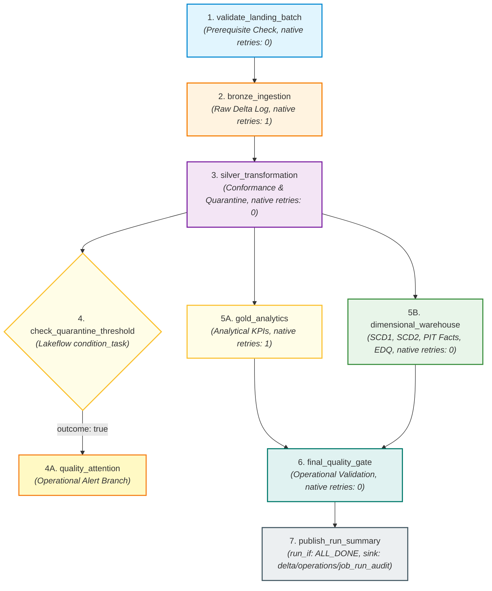
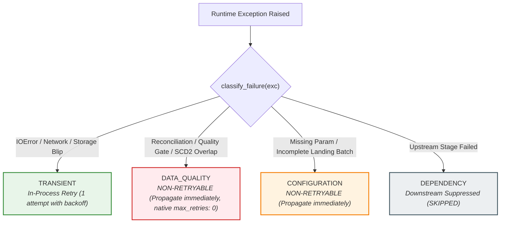

# Module 5: Lakeflow Jobs Orchestration, Reliability & Operational Monitoring

## 1. Executive Summary & Terminology

### Modern Databricks Terminology: Lakeflow Jobs
In modern Azure Databricks architecture, multi-task orchestration workflows are officially called **Lakeflow Jobs** (historically known as *Databricks Workflows* or *Databricks Jobs*).

```
┌────────────────────────────────────────────────────────────────────────┐
│                          LAKEFLOW JOBS                                 │
│  The unified orchestration control plane in Databricks for scheduling, │
│  monitoring, and running multi-task data & AI pipelines with           │
│  built-in reliability, Serverless compute, and repair capabilities.    │
└────────────────────────────────────────────────────────────────────────┘
```

### Orchestration vs. Transformation
- **Transformation (Modules 1–4):** The *computation* applied to data (e.g., PySpark cleansing, window deduplication, Delta MERGE, SCD Type 1 / Type 2, point-in-time surrogate key lookups).
- **Orchestration (Module 5):** The *operational management* of transformations—controlling execution order (DAG), passing run-time parameters, evaluating task health, managing retries, branching on conditions, and recording durable run audits.

---

## 2. Multi-Task DAG Architecture

Module 5 defines a production-grade multi-task Directed Acyclic Graph (DAG) with condition branching in [`databricks/jobs/retail_lakehouse_job.yml`](../databricks/jobs/retail_lakehouse_job.yml):



### Task Responsibilities & Execution Contracts

| Task Key | Type | Depends On | `run_if` | Native Retries | In-Process Retry | Timeout | Task Values Published |
| :--- | :--- | :--- | :--- | :--- | :--- | :--- | :--- |
| `validate_landing_batch` | `notebook_task` | None | `ALL_SUCCESS` | 0 | 1 (Transient only) | 600s | `landing_ready`, `discovered_dataset_count`, `missing_dataset_count`, `ingestion_date`, `adf_run_id`, `landing_root` |
| `bronze_ingestion` | `notebook_task` | `validate_landing_batch` | `ALL_SUCCESS` | 1 | 1 (Transient only) | 1200s | `bronze_rows_ingested`, `datasets_processed` |
| `silver_transformation` | `notebook_task` | `bronze_ingestion` | `ALL_SUCCESS` | 0 | 1 (Transient only) | 1800s | `silver_valid_rows`, `silver_quarantine_rows`, `reconciliation_passed`, `quarantine_rate`, `quarantine_alert_triggered` |
| `check_quarantine_threshold` | `condition_task` | `silver_transformation` | `ALL_SUCCESS` | 0 | 0 | - | Evaluates: `quarantine_alert_triggered == true` |
| `quality_attention` | `notebook_task` | `check_quarantine_threshold` (`outcome: true`) | `ALL_SUCCESS` | 0 | 0 | 300s | `quality_attention_required`, `quarantine_alert_logged` |
| `gold_analytics` | `notebook_task` | `silver_transformation` | `ALL_SUCCESS` | 1 | 1 (Transient only) | 1200s | `gold_tables_generated` |
| `dimensional_warehouse` | `notebook_task` | `silver_transformation` | `ALL_SUCCESS` | 0 | 1 (Transient only) | 2400s | `fact_sales_rows`, `fact_returns_rows`, `warehouse_quality_passed` |
| `final_quality_gate` | `notebook_task` | `gold_analytics`, `dimensional_warehouse` | `ALL_SUCCESS` | 0 | 0 | 600s | `final_quality_gate_passed`, `overall_quality_status` |
| `publish_run_summary` | `notebook_task` | `final_quality_gate` | `ALL_DONE` | 1 | 0 | 300s | None (Persists `JobRunAudit` to Delta & registers UC) |

---

## 3. Real Lakeflow Execution Contracts & Task Wrapper Notebooks

To maintain a clean boundary between **Orchestration Behavior (Module 5)** and **Packaging/Build/CI/CD (Module 6)**, Lakeflow tasks are executed via thin Databricks task wrapper notebooks located in [`databricks/tasks/`](../databricks/tasks/):

- `validate_landing.py`
- `run_bronze.py`
- `run_silver.py`
- `quality_attention.py`
- `run_gold.py`
- `run_warehouse.py`
- `final_quality_gate.py`
- `publish_run_summary.py`

Each task wrapper notebook:
1. Retrieves task parameters from `dbutils.widgets`.
2. Constructs a strongly-typed `RunContext`.
3. Calls the reusable Python implementation from `src/orchestration/tasks/*`.
4. Executes with classified in-process retry logic (`FailureClassification.TRANSIENT`).
5. Publishes runtime telemetry or failure metadata (`failure_classification`, `failure_message`) to Lakeflow Jobs via `dbutils.jobs.taskValues.set()`.

---

## 4. Landing Batch Completeness & Exact Batch Isolation

### 8-Dataset Completeness Requirement
In production batch orchestration, `validate_landing_batch` verifies that all 8 required datasets exist matching both `ingestion_date` and `adf_run_id`:
- `customers`, `products`, `stores`, `employees`, `orders`, `order_items`, `payments`, `returns`.
- If any required dataset is missing, it raises `LandingBatchIncompleteError` and aborts early before compute is consumed on Bronze ingestion.

### String-Safe Cloud URI Composition (`join_storage_uri`)
Cloud URIs (`abfss://<container>@<account>.dfs.core.windows.net/...`) are never wrapped in `pathlib.Path` (which would mutilate `abfss://` into `abfss:/`). The `join_storage_uri` utility ensures safe path composition across both local filesystem and cloud object stores.

### Batch-Isolated Bronze Ingestion
Bronze ingestion accepts optional `ingestion_date` and `adf_run_id` filters. When supplied by the orchestrator, Bronze ingests only files belonging to that specific ADF pipeline run, ensuring strict batch isolation and rerun idempotency.

---

## 5. Conditional Branching: Quarantine Warning vs. Critical Quality Failure

```
┌────────────────────────────────────────────────────────────────────────┐
│                        ARCHITECTURAL DISTINCTION                       │
│                                                                        │
│  QUARANTINE WARNING:                                                   │
│  - Quarantine rate exceeds threshold (e.g. > 20%).                     │
│  - Isolated bad records routed to quarantine. Conformed valid records  │
│    remain mathematically reconciled (Bronze = Valid + Quarantine).     │
│  - Triggers 'quality_attention' branch for operator notification.      │
│  - Downstream Gold & Warehouse processing CONTINUES.                   │
│                                                                        │
│  CRITICAL DATA QUALITY FAILURE:                                        │
│  - Broken mathematical reconciliation (ReconciliationError).           │
│  - Broken surrogate key invariants (WarehouseQualityGateError).        │
│  - Hard-fails the task immediately and aborts downstream execution.    │
└────────────────────────────────────────────────────────────────────────┘
```

---

## 6. Two-Tier Retry Strategy: Native Lakeflow vs. Classified In-Process Retries



### Architectural Realism
- **Native Lakeflow `max_retries`:** Operates strictly at the task process level and does not inspect Python exception types. If set to `1` on Silver, Databricks will blindly retry broken arithmetic or schema errors.
- **Project Solution:** Set native `max_retries: 0` on deterministic-quality tasks (`validate_landing_batch`, `silver_transformation`, `dimensional_warehouse`, `final_quality_gate`), and execute classified retries inside task wrapper code using `RetryPolicy` for transient exceptions only.

---

## 7. Cloud Failure Auditing & Run Summary Resolution

Under `run_if: ALL_DONE` semantics, the `publish_run_summary` task executes on both success and failure runs:
- **Real Start Time:** Receives `job_start_time = {{job.start_time.iso_datetime}}` to measure full pipeline wall-clock duration accurately.
- **Result States & Error Codes:** Receives upstream task result states (`{{tasks.<task>.result_state}}`) and error codes (`{{tasks.<task>.error_code}}`).
- **Root Failure Resolution:** Inspects DAG tasks in sequence, identifies the earliest failing task, reads published `failure_classification` and `failure_message` task values, and populates RCA fields in `JobRunAudit`. If no task-published classification exists, falls back conservatively (e.g. `timedout` ➔ `TRANSIENT`, generic failure ➔ `UNKNOWN`).
- **Operational Health Thresholds:** Job health duration threshold (`RUN_DURATION_SECONDS > 3600`) is version-controlled. Notification destinations are intentionally not embedded in executable YAML; environment-specific notifications are deferred to deployment/environment configuration in Module 6.

---

## 8. Zero Legacy DBFS Mount Paths & Operations Catalog Registration

### No Legacy `/mnt/` Dependencies
Module 5 completely eliminates legacy `/mnt/` DBFS mount paths. All Delta tables use governed ABFSS URIs or Unity Catalog 3-level namespace identifiers.

### Operations Unity Catalog Schema
After the Delta audit path exists, the runtime attempts registration under `<catalog>.operations.job_run_audit`; Databricks cloud verification remains pending:
```sql
CREATE CATALOG IF NOT EXISTS retail_lakehouse;
CREATE SCHEMA IF NOT EXISTS retail_lakehouse.operations;
CREATE TABLE IF NOT EXISTS retail_lakehouse.operations.job_run_audit
USING DELTA
LOCATION 'abfss://lakehouse@stlakehousedev.dfs.core.windows.net/delta/operations/job_run_audit';
```

---

## 9. Repair-Run Workflow Demonstration

In Databricks Lakeflow Jobs, when a pipeline fails at a downstream task (e.g. `dimensional_warehouse`), operators can trigger a **Repair Run**:
1. Completed upstream tasks (`validate_landing_batch`, `bronze_ingestion`, `silver_transformation`) are **skipped** without re-executing.
2. The repaired task re-runs.
3. Due to Module 3 and Module 4 deterministic surrogate key generation and Delta MERGE idempotency, the idempotent Delta design is intended to make repair runs safe for unchanged inputs. Real production concurrency and cloud behavior remain subject to cloud verification.

---

## 10. Verification & Cloud Status

- **Ruff Static Analysis:** 0 errors (`All checks passed!`)
- **Cloud Verification Status:** `LAKEFLOW JOB DEFINITION: DEPLOYMENT-READY`, `CLOUD EXECUTION: PENDING`
- **Learning Status:** `NOT STUDIED / PENDING`
