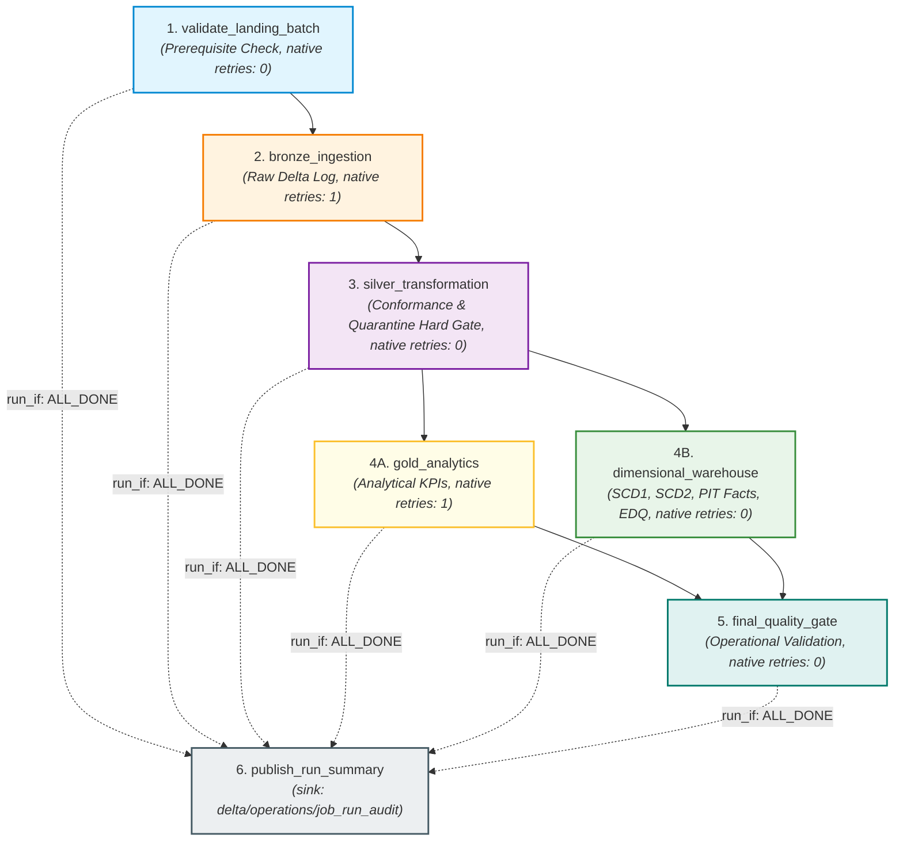
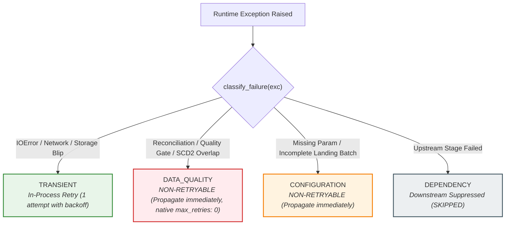

# Module 5: Lakeflow Jobs Orchestration, Reliability & Operational Monitoring

## 1. Executive Summary & Terminology

### Modern Databricks Terminology: Lakeflow Jobs
In modern Azure Databricks architecture, multi-task orchestration workflows are officially called **Lakeflow Jobs** (historically known as *Databricks Workflows* or *Databricks Jobs*).

```
┌────────────────────────────────────────────────────────────────────────┐
│                          LAKEFLOW JOBS                                 │
│  The unified orchestration control plane in Databricks for scheduling, │
│  monitoring, and running multi-task data & AI pipelines with           │
│  built-in reliability, Serverless compute, and repair capabilities.    │
└────────────────────────────────────────────────────────────────────────┘
```

### Orchestration vs. Transformation
- **Transformation (Modules 1–4):** The *computation* applied to data (e.g., PySpark cleansing, window deduplication, Delta MERGE, SCD Type 1 / Type 2, point-in-time surrogate key lookups).
- **Orchestration (Module 5):** The *operational management* of transformations—controlling execution order (DAG), passing run-time parameters, evaluating task health, managing retries, branching on conditions, and recording durable run audits.

---

## 2. Multi-Task DAG Architecture

Module 5 defines a multi-task Directed Acyclic Graph (DAG) in [`databricks/jobs/retail_lakehouse_job.yml`](../databricks/jobs/retail_lakehouse_job.yml):



### Task Responsibilities & Execution Contracts

| Task Key | Type | Depends On | `run_if` | Native Retries | In-Process Retry | Timeout | Task Values Published |
| :--- | :--- | :--- | :--- | :--- | :--- | :--- | :--- |
| `validate_landing_batch` | `notebook_task` | None | `ALL_SUCCESS` | 0 | 1 (Transient only) | 600s | `terminal_state`, `landing_ready`, `discovered_dataset_count`, `missing_dataset_count`, `ingestion_date`, `adf_run_id`, `landing_root` |
| `bronze_ingestion` | `notebook_task` | `validate_landing_batch` | `ALL_SUCCESS` | 1 | 1 (Transient only) | 1200s | `terminal_state`, `bronze_rows_ingested`, `datasets_processed` |
| `silver_transformation` | `notebook_task` | `bronze_ingestion` | `ALL_SUCCESS` | 0 | 1 (Transient only) | 1800s | `terminal_state`, `silver_valid_rows`, `silver_quarantine_rows`, `reconciliation_passed`, `quarantine_rate`, `quarantine_alert_triggered` |
| `gold_analytics` | `notebook_task` | `silver_transformation` | `ALL_SUCCESS` | 1 | 1 (Transient only) | 1200s | `terminal_state`, `gold_tables_generated` |
| `dimensional_warehouse` | `notebook_task` | `silver_transformation` | `ALL_SUCCESS` | 0 | 1 (Transient only) | 2400s | `terminal_state`, `fact_sales_rows`, `fact_returns_rows`, `warehouse_quality_passed` |
| `final_quality_gate` | `notebook_task` | `gold_analytics`, `dimensional_warehouse` | `ALL_SUCCESS` | 0 | 0 | 600s | `terminal_state`, `final_quality_gate_passed`, `overall_quality_status` |
| `publish_run_summary` | `notebook_task` | All upstream tasks | `ALL_DONE` | 1 | 0 | 300s | None (Persists `JobRunAudit` to Delta & registers UC) |

- `validate_landing.py`
- `run_bronze.py`
- `run_silver.py`
- `run_gold.py`
- `run_warehouse.py`
- `final_quality_gate.py`
- `publish_run_summary.py`

Each primary task wrapper notebook:
1. Retrieves job-level parameters pushed automatically into `dbutils.widgets` (`environment`, `ingestion_date`, `adf_run_id`, `storage_account_name`, `container_name`, `catalog_name`).
2. Constructs a strongly-typed `RunContext`.
3. Calls the reusable Python implementation from `src/orchestration/tasks/*`.
4. Executes with classified in-process retry logic (`FailureClassification.TRANSIENT`).
5. On success, publishes `terminal_state = "SUCCESS"` and throughput metrics via `dbutils.jobs.taskValues.set()`.
6. On caught exception, publishes `terminal_state = "FAILED"`, `failure_classification`, and `failure_message` before re-raising.

---

## 4. Landing Batch Completeness & Exact Batch Isolation

### 8-Dataset Completeness Requirement
In batch orchestration, `validate_landing_batch` verifies that all 8 required datasets exist matching both `ingestion_date` and `adf_run_id`:
- `customers`, `products`, `stores`, `employees`, `orders`, `order_items`, `payments`, `returns`.
- If any required dataset is missing, it raises `LandingBatchIncompleteError` and aborts early before compute is consumed on Bronze ingestion.

### String-Safe Cloud URI Composition (`join_storage_uri`)
Cloud URIs (`abfss://<container>@<account>.dfs.core.windows.net/...`) are never wrapped in `pathlib.Path` (which would mutilate `abfss://` into `abfss:/`). The `join_storage_uri` utility ensures safe path composition across both local filesystem and cloud object stores.

### Batch-Isolated Bronze Ingestion
Bronze ingestion accepts optional `ingestion_date` and `adf_run_id` filters. When supplied by the orchestrator, Bronze ingests only files belonging to that specific ADF pipeline run, ensuring strict batch isolation and rerun idempotency.

---

## 5. Hard Data Quality Gate: Quarantine Threshold Policy

```
┌────────────────────────────────────────────────────────────────────────┐
│                        DATA QUALITY GATE POLICY                        │
│                                                                        │
│  QUARANTINE THRESHOLD GATE:                                            │
│  - Evaluated after Silver valid and quarantine tables are persisted.   │
│  - If quarantine_rate <= threshold: PASSES (rate == threshold is PASS).│
│  - If quarantine_rate > threshold: raises QuarantineThresholdExceeded. │
│  - Classification: DATA_QUALITY (Zero Retries).                        │
│  - Downstream Gold, Warehouse, and Final Quality tasks are SKIPPED.    │
│  - publish_run_summary executes under run_if: ALL_DONE to log audit.   │
└────────────────────────────────────────────────────────────────────────┘
```

---

## 6. Two-Tier Retry Strategy: Native Lakeflow vs. Classified In-Process Retries



### Architectural Realism
- **Native Lakeflow `max_retries`:** Operates strictly at the task process level and does not inspect Python exception types. If set to `1` on Silver, Databricks will blindly retry broken arithmetic or schema errors.
- **Project Solution:** Set native `max_retries: 0` on deterministic-quality tasks (`validate_landing_batch`, `silver_transformation`, `dimensional_warehouse`, `final_quality_gate`), and execute classified retries inside task wrapper code using `RetryPolicy` for transient exceptions only.

---

## 7. Cloud Failure Auditing & Run Summary Resolution

Under `run_if: ALL_DONE` semantics, the `publish_run_summary` task executes on both success and failure runs:
- **Bundle Job Parameter Pushdown:** Job metadata (`job_id = {{job.id}}`, `job_run_id = {{job.run_id}}`, `job_start_time = {{job.start_time.iso_datetime}}`) and environment parameters are pushed down directly to notebook widgets at the job level.
- **Cross-Task Telemetry via Task Values:** Rather than relying on invalid notebook `base_parameters`, upstream tasks communicate runtime metrics, `terminal_state`, `failure_classification`, and `failure_message` via Databricks native `dbutils.jobs.taskValues`.
- **Root Failure Resolution (`resolve_failed_task_from_task_values`):**
  - **Explicit Failure:** If a primary task published `terminal_state = "FAILED"`, its published classification and error message are recorded as the root cause.
  - **Infrastructure Termination:** If a task terminated abruptly (eviction, cancellation, node loss) before Python could catch the exception, the first primary task missing a `terminal_state = "SUCCESS"` marker is conservatively recorded as the failure candidate with classification `UNKNOWN`.
  - **All-Success:** If all 6 primary tasks (`validate_landing_batch`, `bronze_ingestion`, `silver_transformation`, `gold_analytics`, `dimensional_warehouse`, `final_quality_gate`) published `terminal_state = "SUCCESS"`, `JobRunAudit` records `final_status = "SUCCESS"`.
- **Operational Health Thresholds:** Job health duration threshold (`RUN_DURATION_SECONDS > 3600`) is version-controlled.

---

## 8. Zero Legacy DBFS Mount Paths & Operations Catalog Registration

### No Legacy `/mnt/` Dependencies
Module 5 completely eliminates legacy `/mnt/` DBFS mount paths. All Delta tables use governed ABFSS URIs or Unity Catalog 3-level namespace identifiers.

### Operations Unity Catalog Schema
After the Delta audit path exists, the runtime attempts registration under `<catalog>.operations.job_run_audit`; Databricks cloud verification remains pending:
```sql
CREATE CATALOG IF NOT EXISTS retail_lakehouse;
CREATE SCHEMA IF NOT EXISTS retail_lakehouse.operations;
CREATE TABLE IF NOT EXISTS retail_lakehouse.operations.job_run_audit
USING DELTA
LOCATION 'abfss://lakehouse@stlakehousedev.dfs.core.windows.net/delta/operations/job_run_audit';
```

---

## 9. Repair-Run Workflow Demonstration

In Databricks Lakeflow Jobs, when a pipeline fails at a downstream task (e.g. `dimensional_warehouse`), operators can trigger a **Repair Run**:
1. Completed upstream tasks (`validate_landing_batch`, `bronze_ingestion`, `silver_transformation`) are **skipped** without re-executing.
2. The repaired task re-runs.
3. Due to Module 3 and Module 4 deterministic surrogate key generation and Delta MERGE idempotency, the idempotent Delta design makes repair runs safe for unchanged inputs.

---

## 10. Verification & Cloud Status

- **Ruff Static Analysis:** 0 errors (`All checks passed!`)
- **Pytest Suite:** 104 / 104 tests passing repository-wide.
- **Cloud Verification Status:** `LAKEFLOW JOB DEFINITION: DEPLOYMENT-READY`, `CLOUD EXECUTION: PENDING`
- **Learning Status:** `NOT STUDIED / PENDING`
