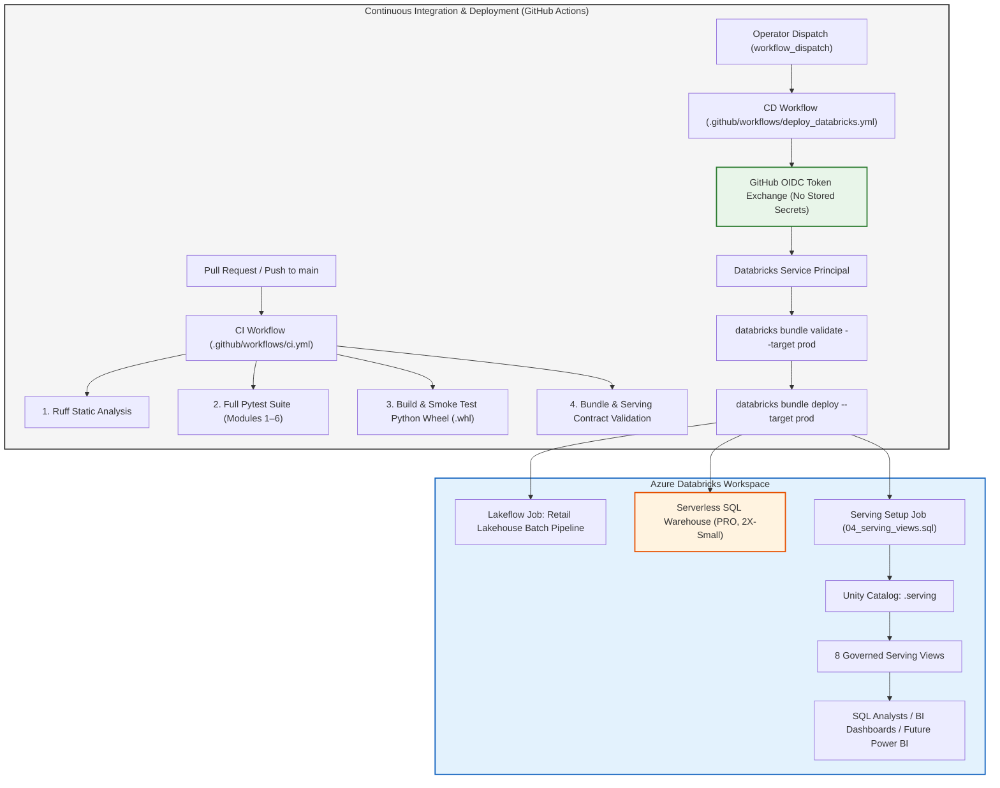

# Module 6: Production CI/CD, Declarative Automation Bundles & Governed SQL Serving

## 1. Executive Summary & Architectural Overview

Module 6 operationalizes the omnichannel retail data platform with enterprise-grade release automation, zero-secret continuous deployment, and a governed analytical serving layer.

```
┌────────────────────────────────────────────────────────────────────────┐
│                        MODULE 6 CAPABILITIES                           │
│                                                                        │
│  1. Python Release Packaging: Wheel (.whl) distribution via setuptools │
│  2. Declarative Automation Bundles: Multi-environment Databricks IaC   │
│  3. Automated CI Pipeline: GitHub Actions running Ruff, Pytest & Wheel │
│  4. Zero-Secret CD: Workload Identity Federation (GitHub OIDC)         │
│  5. Governed SQL Serving: Serverless Databricks SQL Warehouse & Views  │
└────────────────────────────────────────────────────────────────────────┘
```



---

## 2. Python Release Packaging

The platform logic across Modules 1–5 is packaged as a standard Python release wheel (`retail_lakehouse_data_platform-0.1.0-py3-none-any.whl`) via `pyproject.toml` and `build`:

```toml
[build-system]
requires = ["setuptools>=61.0", "wheel"]
build-backend = "setuptools.build_meta"

[project]
name = "retail-lakehouse-data-platform"
version = "0.1.0"
requires-python = ">=3.10"
dependencies = [
    "pyspark>=3.5.0,<3.6.0",
    "delta-spark>=3.2.0,<3.3.0",
    "pyarrow>=14.0.0",
    "Faker>=28.0.0",
    "pyyaml>=6.0.0",
]
```

### Packaging & Orchestration Boundary
- **Wheel (`.whl`):** Release artifact containing the reusable library code (`src/medallion`, `src/modeling`, `src/orchestration`, `src/quality`, `src/schemas`).
- **Lakeflow Tasks (`databricks/tasks/`):** Thin task wrapper notebooks that import from the installed wheel or workspace files, retrieve Lakeflow widgets, execute with in-process retries, and set Lakeflow task values.

---

## 3. Declarative Automation Bundle Architecture

Databricks **Declarative Automation Bundles** (historically called *Databricks Asset Bundles*) manage all lakehouse resources as code.

### Root Bundle Specification (`databricks.yml`)
```yaml
bundle:
  name: "retail-lakehouse-data-platform"

include:
  - "databricks/jobs/*.yml"
  - "databricks/resources/*.yml"

artifacts:
  retail_lakehouse_wheel:
    type: whl
    path: .
    build: python -m build --wheel

targets:
  dev:
    mode: development
    default: true
    workspace:
      root_path: "/Workspace/Users/${workspace.current_user.userName}/.bundle/${bundle.name}/${bundle.target}"
    variables:
      environment: "dev"
      catalog_name: "retail_lakehouse"

  prod:
    mode: production
    workspace:
      root_path: "/Shared/.bundle/${bundle.name}/${bundle.target}"
    run_as:
      service_principal_name: "${var.deployment_sp_id}"
    variables:
      environment: "prod"
      catalog_name: "retail_lakehouse_prod"
```

### Target Isolation
- **`dev` Target:** Uses `mode: development`, deploys to the individual developer's workspace directory, prefixes resource names with developer username, and uses development storage accounts.
- **`prod` Target:** Uses `mode: production`, runs under a governed Service Principal identity (`run_as: { service_principal_name: ... }`), and targets production Unity Catalog schemas.

---

## 4. GitHub Actions CI/CD & Zero-Secret OIDC Authentication

### Continuous Integration (`.github/workflows/ci.yml`)
Runs on every Pull Request and merge to `main`:
1. Checks out repository.
2. Configures Python 3.11 and Java 17 (Temurin).
3. Executes Ruff static analysis (`ruff check .`).
4. Executes complete Pytest suite (Modules 1–6).
5. Builds the Python wheel (`python -m build --wheel`).
6. Installs wheel in an isolated clean virtualenv and verifies smoke imports.
7. Validates bundle configuration and serving view SQL syntax.

### Continuous Deployment (`.github/workflows/deploy_databricks.yml`)
- **Safe by Default:** Triggered manually via `workflow_dispatch` (not automated on every push).
- **Concurrency Control:** `concurrency: { group: databricks-deployment-${{ inputs.target }}, cancel-in-progress: false }` ensures zero overlapping deployments.
- **Workload Identity Federation (GitHub OIDC):**
  - Requests token: `permissions: { id-token: write, contents: read }`.
  - Configures `DATABRICKS_AUTH_TYPE: "github-oidc"`.
  - Uses `DATABRICKS_HOST` and `DATABRICKS_CLIENT_ID` configured in GitHub Environment `production`.
  - **Zero Stored Secrets:** No Personal Access Tokens (PATs) or long-lived client secrets are stored in GitHub Secrets.

---

## 5. Governed SQL Serving Architecture

The serving layer exposes governed analytical SQL views over the Gold KPI aggregate tables and the Kimball dimensional warehouse without copying underlying data.

```
┌────────────────────────────────────────────────────────────────────────┐
│                        SERVING ARCHITECTURE                            │
│                                                                        │
│  COMPUTE: Serverless Databricks SQL Warehouse (PRO SKU, 2X-Small)      │
│  SCHEMA:  <catalog>.serving (e.g. retail_lakehouse.serving)            │
│  OBJECTS: 8 Governed SQL Views                                         │
└────────────────────────────────────────────────────────────────────────┘
```

### Serverless SQL Warehouse Resource (`databricks/resources/sql_serving.yml`)
```yaml
resources:
  sql_warehouses:
    retail_lakehouse_serving_warehouse:
      name: "${var.serving_warehouse_name}"
      cluster_size: "2X-Small"
      min_num_clusters: 1
      max_num_clusters: 1
      auto_stop_mins: 10
      warehouse_type: "PRO"
      enable_serverless_compute: true
```

### Governed Serving Views (`databricks/sql/04_serving_views.sql`)

| Serving View Name | Source Layer | Underlying Tables | Description |
| :--- | :--- | :--- | :--- |
| `daily_sales_performance` | Gold | `gold.gold_daily_sales_performance` | Daily sales, profit, returns, and discounts |
| `monthly_revenue` | Gold | `gold.gold_monthly_revenue` | Monthly net retained revenue and unit volume |
| `store_region_revenue` | Gold | `gold.gold_revenue_by_store_region` | Store regional performance and average order value |
| `category_revenue_performance` | Gold | `gold.gold_category_revenue_performance` | Product category sales, profitability, and return rates |
| `customer_spending_summary` | Gold | `gold.gold_customer_spending_summary` | VIP customer lifetime spend and cohort metrics |
| `return_refund_performance` | Gold | `gold.gold_return_refund_performance` | Return reasons and refund totals |
| `sales_detail` | Warehouse | `warehouse.fact_sales` + 5 Dimensions | Line-item sales joined to SCD2 customer, SCD1 product, store, employee, and calendar dimensions |
| `returns_detail` | Warehouse | `warehouse.fact_returns` + 4 Dimensions | Line-item return records joined to customer, product, store, and date dimensions |

---

## 6. Point-in-Time SCD2 Join Correctness in `sales_detail`

In the `sales_detail` serving view, joining `fact_sales` to `dim_customer` is performed on `customer_key`:

```sql
SELECT
    s.order_item_id,
    s.net_amount,
    s.profit_amount,
    c.loyalty_tier AS customer_historical_loyalty_tier,
    c.city AS customer_historical_city
FROM warehouse.fact_sales s
JOIN warehouse.dim_customer c ON s.customer_key = c.customer_key
...
```

### Why This Is Architecturally Critical:
- `fact_sales.customer_key` was already point-in-time resolved during the Module 4 warehouse load (`order_timestamp >= effective_from AND (order_timestamp < effective_to OR effective_to IS NULL)`).
- Joining on `customer_key` in the serving layer guarantees that analysts see the **exact customer loyalty tier and address that was valid when the purchase occurred**, without needing expensive or error-prone range joins in BI tools.

---

## 7. Verification Status & Cloud Honesty

- **Local Packaging & Build:** `VERIFIED` (`python -m build --wheel` builds clean wheel and smoke tests pass).
- **Bundle & Resource Schema:** `VERIFIED` (Automated structural and contract test suite passes).
- **GitHub Actions CI Workflow:** `IMPLEMENTED / LOCAL TESTED` (Runs clean locally; remote CI execution pending repository push).
- **Databricks Cloud Deployment:** `PENDING` (Subject to live Azure Databricks workspace and GitHub OIDC federation setup).
- **Serverless SQL Warehouse Cloud Creation:** `PENDING`
- **Learning Status:** `NOT STUDIED / PENDING`
